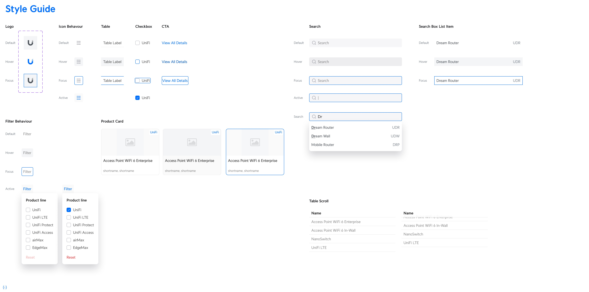

# UIDB Explorer

Internal Product Knowledge Explorer for Ubiquiti devices.

This is the Frontend Engineer homework submission from Artis Avotins.

[Try it!](https://artis101.github.io/ubiquiti-device-explorer/)

## Synopsis

React 19, Vite, Tailwind CSS, Zod for schema resilience, React Window for virtualization, URL-based state management, and Playwright for testing.

What can be improved?

- use of a proper UI system/shadcn
- Service Worker to create an image cache, avoids HTTP requests while scrolling
- automated a11y tests
- zustand store for state management would be better, but this works fine

## Assignment

You are tasked with kick-starting an internal tool, the "UIDB Explorer," for another team at Ubiquiti to take over. The goal is to create a robust foundation within one week.

### Core Task

Build a React and TypeScript application that allows internal teams (Developers, Designers, PMs) to explore, search, and visualize products from the internal UIDB (Ubiquiti Database).

### Key Features & Requirements

- **Product Discovery:** Display products from the UIDB, showing key information like `product.name`, `line`, `shortnames`, and images.
- **Image Rendering:** Construct and display product images using the provided URL format: `https://images.svc.ui.com/?u=...&w=${size}&q=75`.
- **Filtering & Searching:** Allow users to filter products by `line` and search across various fields.
- **Schema Resilience:** The application must be robust and handle potential future changes to the UIDB JSON schema without crashing. It should fail gracefully.

## Visual reference

Here are the UI mockups from the design reference.

### Main View

### Grid View

## Detail View

### Design Reference

### Technical Constraints

- **Stack:** React and TypeScript are mandatory. You have the freedom to choose other libraries and tools.
- **Hand-off:** The project must be self-contained within a Git repository. All documentation and setup instructions must be clear, as there is no direct communication with the receiving team.

### Deliverables

1.  **A Git Repository:** Containing the complete, well-structured, and documented source code.
2.  **A Live Deployment:** A publicly accessible URL where non-technical stakeholders can view and interact with the latest version of the application.
